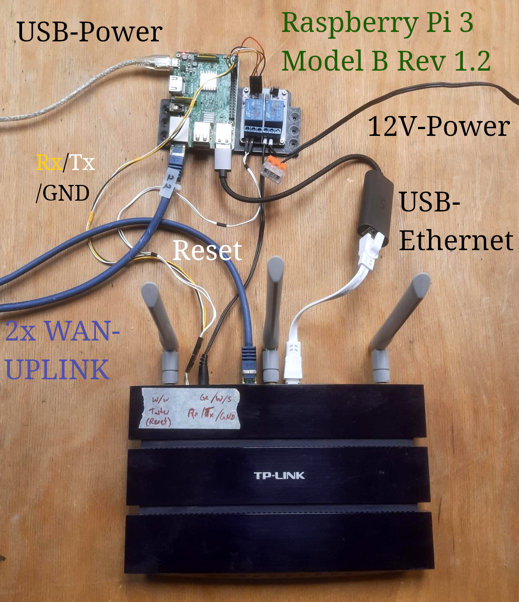

# Devices in LeineLab Testlab

## Coordinator/Exporter
- Raspberry Pi 3
    - Ethernet (eth0): Uplink
    - USB NIC (eth1): Connected to LAN iface of TPLink 1043
    - Hardware serial: Connected to hardware serial of TPLink 1043
    - GPIO: Control power and reset-pin of TPLink 1043 via Relays

## DUT
- TPLink 1043
    - WAN-Port: Uplink
    - LAN-Port 1: Connected to USB NIC of Raspberry Pi
    - LAN-Port 2: n/c
    - LAN-Port 3: n/c
    - LAN-Port 4: n/c
    - Serial: Connected to hardware serial of TPLink 1043
    - Power: Controlled by relais via GPIO
    - Reset-Pin: Controlled by relais via GPIO

## Misc Hardware

n/a
